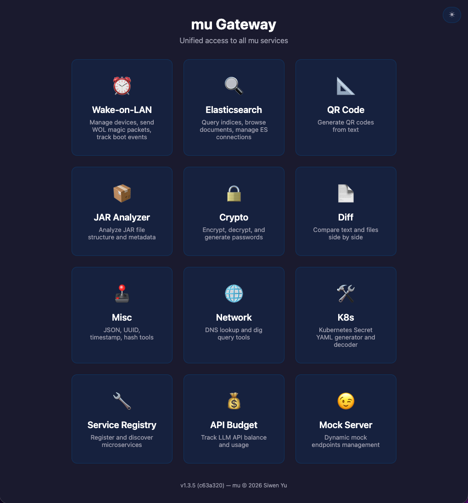

# mu (myUtilities)

A multi-purpose CLI tool with subcommands for common development and operations tasks.



## Features

| Command | Type | Description | Web UI |
|---|---|---|---|
| `install` | DevOps | Install binaries from GitHub releases (asset search, tags, tokens) | – |
| `mock` | Testing | Mock servers: mock-server, file-server, oauth-server, dynamic-server with admin UI | ✓ |
| `qrcode` | Utils | Generate QR codes (terminal, PNG, web UI) | ✓ |
| `serve` | DevOps | Static file server with CORS and logging | – |
| `svcreg` | Ops | Service registry server (ServiceCenter-compatible) + dashboard | ✓ |
| `proxy` | Ops | Database proxy with failover (Oracle) | – |
| `run` | DevOps | Command runner with live display + YAML recipe orchestration | – |
| `wol` | Ops | Wake-on-LAN server, boot/shutdown agent, interface discovery | ✓ |
| `es` | Data | Elasticsearch query tool (status, indices, search) | ✓ |
| `git` | Dev | AI commit messages, multi-turn code review, .gitignore templates | – |
| `watch` | Ops | Watch filesystem / git remotes for changes | – |
| `k8s` | Cloud | Kubernetes Secret YAML generator + resource browser | ✓ |
| `jar` | Dev | Analyze JAR files (JDK version, manifest, Maven coords) | ✓ |
| `gateway` | Ops | Unified portal serving all web-enabled modules | ✓ |
| `diff` | Dev | Side-by-side text/file comparison | ✓ |
| `network` | Net | DNS, DIG, and WHOIS lookups | ✓ |
| `misc` | Utils | JSON format/validate, UUID, timestamp, hash, trackers | ✓ |
| `crypto` | Utils | Encrypt/decrypt, passwords, JWT, encode/decode | ✓ |
| `ask` | AI | Ask an LLM questions (optional web search) | – |
| `budget` | AI | Track LLM API usage/balance across providers | ✓ |
| `metrics` | Ops | Time-series host metrics collection and querying | – |
| `scip` | Dev | SCIP semantic code intelligence (indexers + index) | – |
| `fleet` | DevOps | Remote batch execution: dispatcher + agents, file transfer | – |
| `completion` | Dev | Generate bash/zsh completion scripts | – |

## Build

```bash
# Build for current platform (automatically builds all Svelte frontends)
make linux-amd64     # Linux x86_64
make linux-arm64     # Linux ARM64
make darwin-arm64    # macOS Apple Silicon
make windows-amd64   # Windows x86_64

# Build all common platforms
make all

# Quick build without frontends (no version injection)
make

# Build output is in bin/ directory
```

> **Note:** The build automatically compiles the Svelte frontends for all
> web-enabled modules (WOL, ES, Mock Dynamic, QR Code, JAR Analyzer, Crypto,
> Diff, K8s, Misc, Network, SvcReg, Budget). Ensure `npm` is installed before
> building.

## Usage

```
mu <command> [subcommand] [flags]
```

Each subcommand has dedicated documentation:

| Command | Description |
|---|---|
| [ask](docs/ask.md) | Ask an LLM questions (optional web search) |
| [install](docs/install.md) | Install binaries from GitHub releases |
| [crypto](docs/crypto.md) | Encrypt/decrypt, passwords, JWT, encode/decode |
| [diff](docs/diff.md) | Side-by-side text/file comparison |
| [budget](docs/budget.md) | Track LLM API usage/balance across providers |
| [set](docs/set.md) | Unified module configuration |
| [es](docs/es.md) | Elasticsearch query tool |
| [k8s](docs/k8s.md) | Kubernetes Secret YAML generator + resource browser |
| [mock](docs/mock.md) | Mock servers for testing |
| [svcreg](docs/svcreg.md) | Service registry server (ServiceCenter-compatible) |
| [gateway](docs/gateway.md) | Unified portal serving all web-enabled modules |
| [misc](docs/misc.md) | JSON format/validate, UUID, timestamp, hash, trackers |
| [network](docs/network.md) | DNS, DIG, and WHOIS lookups |
| [metrics](docs/metrics.md) | Time-series host metrics collection and querying |
| [completion](docs/completion.md) | Generate bash/zsh completion scripts |
| [proxy](docs/proxy.md) | Database proxy with failover |
| [run](docs/run.md) | Command runner with live display + YAML recipe orchestration |
| [fleet](docs/fleet.md) | Remote batch execution: dispatcher + agents, file transfer |
| [git](docs/git.md) | AI commit messages, multi-turn code review, .gitignore templates |
| [watch](docs/watch.md) | Watch filesystem / git remotes for changes |
| [qrcode](docs/qrcode.md) | Generate QR codes (terminal, PNG, web UI) |
| [serve](docs/serve.md) | Static file server with CORS and logging |
| [jar](docs/jar.md) | Analyze JAR files (JDK version, manifest, Maven coords) |
| [wol](docs/wol.md) | Wake-on-LAN server, boot/shutdown agent, interface discovery |
